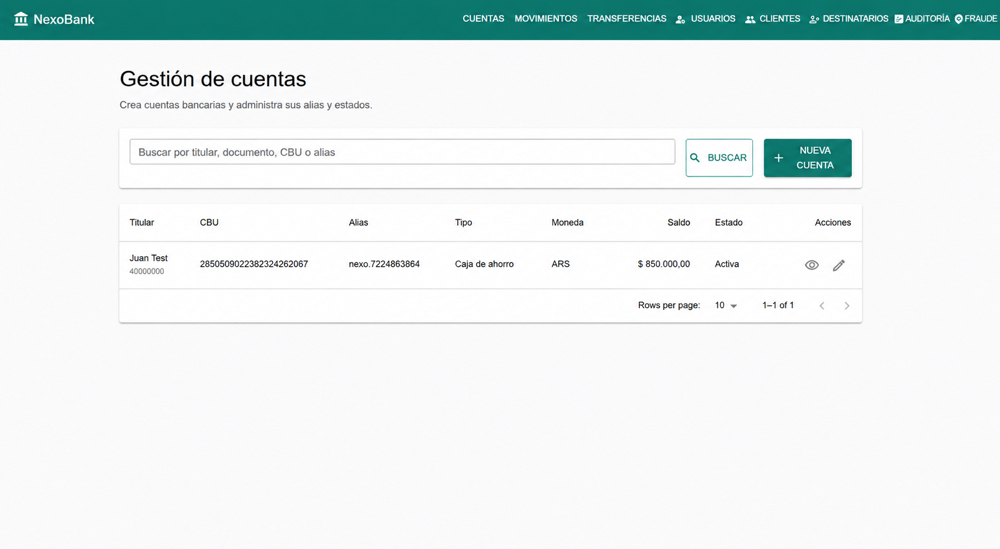
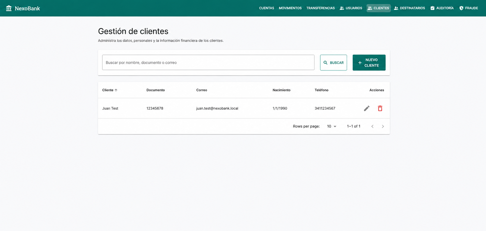
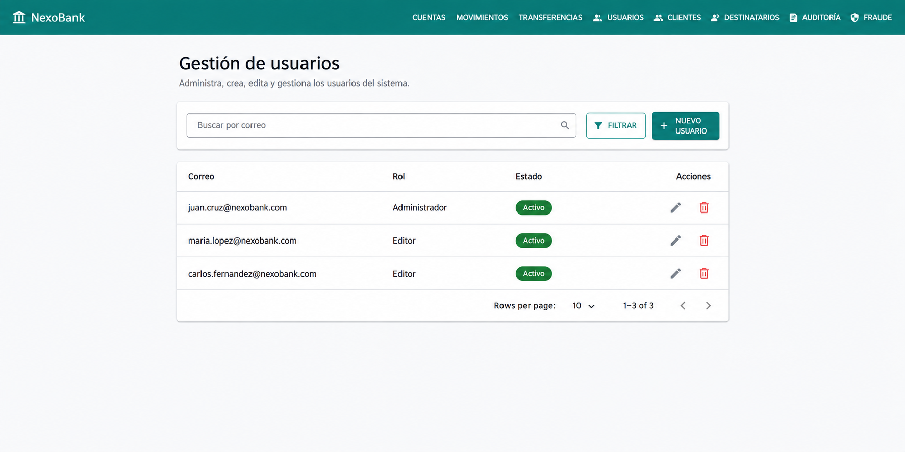
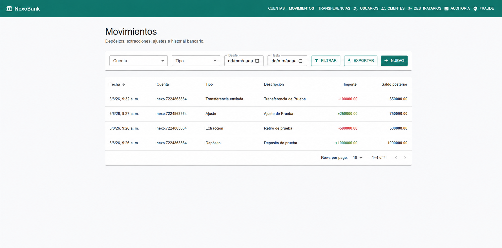
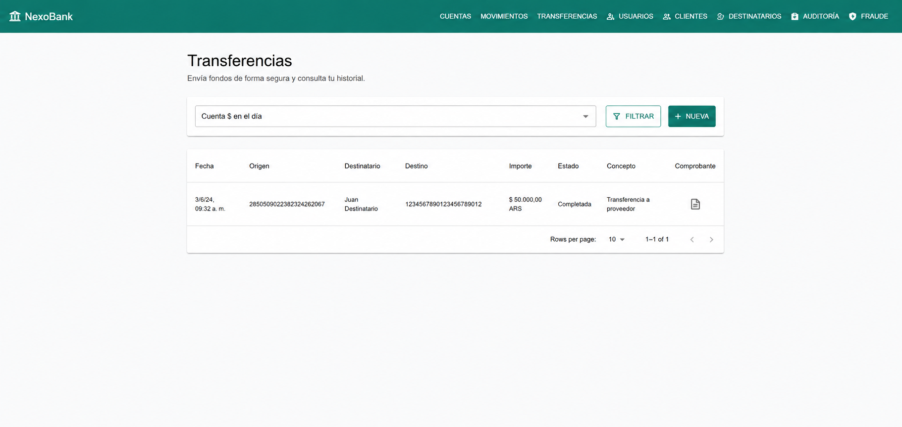
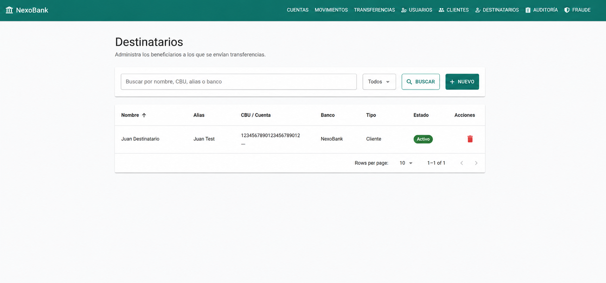
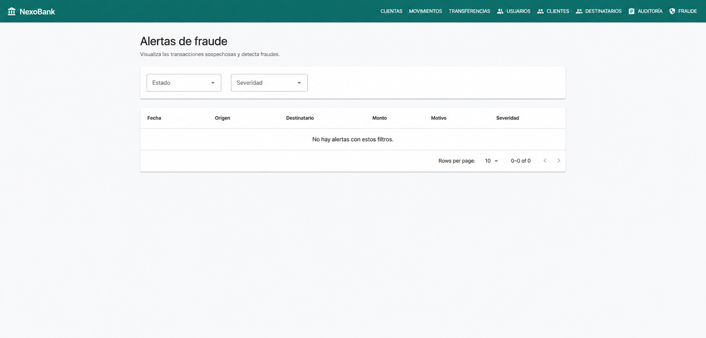
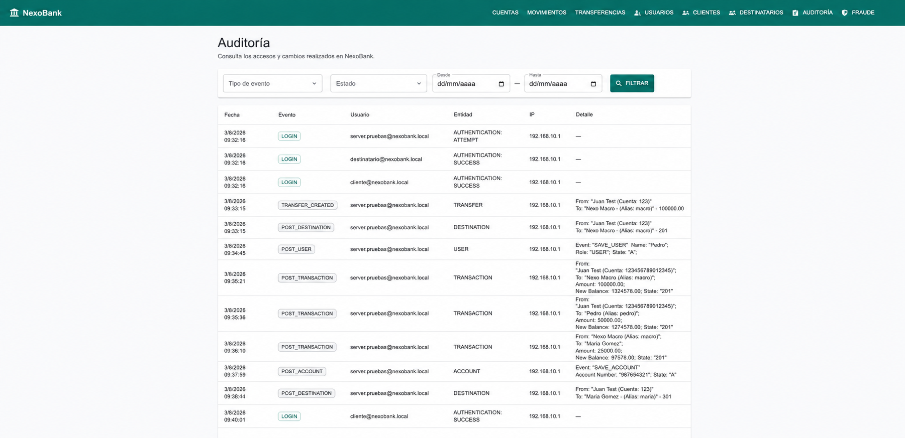

# NexoBank

Plataforma bancaria full stack que modela la administración de clientes, cuentas, movimientos y transferencias con foco en **consistencia monetaria, seguridad y trazabilidad**. Incluye autenticación JWT, refresh token en cookie HttpOnly, autorización por roles, transferencias idempotentes, ledger de doble entrada, auditoría y alertas de fraude.

[▶ Ver video demostrativo](https://drive.google.com/file/d/1JFGAoxfQuZV8G1chXaDHK8XVBlAx3nEw/view?usp=sharing) · [Arquitectura](docs/architecture.md) · [API](docs/api.md) · [Colección Postman](docs/postman/NexoBank.postman_collection.json)

> **Proyecto demostrativo:** NexoBank no es una entidad financiera ni procesa dinero real. Las credenciales y valores predeterminados son exclusivamente para desarrollo local.



## Funcionalidades

- Gestión de usuarios, clientes, cuentas y destinatarios.
- Depósitos, retiros, ajustes y consulta paginada de movimientos.
- Transferencias idempotentes con validación de saldo, moneda y estado de cuentas.
- Ledger de doble entrada con débitos y créditos balanceados por asiento.
- Comprobantes, auditoría con contexto de solicitud y revisión de alertas de fraude.
- Sesiones con access token de corta duración y refresh token rotatorio en cookie HttpOnly.
- Rate limiting configurable para registro, login y renovación de sesión.
- Métricas, health checks e integración con Prometheus mediante Spring Boot Actuator.
- Panel administrativo responsive y contrato OpenAPI interactivo.

## Recorrido visual

| Clientes | Usuarios |
| --- | --- |
|  |  |
| **Movimientos** | **Transferencias** |
|  |  |
| **Destinatarios** | **Fraude** |
|  |  |
| **Auditoría** | **Cuentas** |
|  |  |

## Stack

| Capa | Tecnologías |
| --- | --- |
| Backend | Java 21, Spring Boot 4, Spring Security, Spring Data JPA, Flyway |
| Frontend | React 19, TypeScript, Vite, TanStack Query, Material UI |
| Datos | PostgreSQL 17, H2 para tests |
| Calidad | JUnit, JaCoCo, Vitest, Testing Library, Playwright, ESLint, Prettier |
| Operación | Docker Compose, GitHub Actions, Actuator, Micrometer, Prometheus |

## Decisiones técnicas destacadas

- **Monolito modular:** mantiene límites claros por dominio sin la complejidad operativa de microservicios.
- **Dinero con `BigDecimal`:** PostgreSQL usa `NUMERIC(19,2)` y restricciones de integridad.
- **Consistencia:** las operaciones monetarias y sus asientos se confirman en una única transacción.
- **Concurrencia:** las cuentas usan bloqueo optimista y las claves de idempotencia son únicas.
- **Esquema versionado:** Flyway administra migraciones; Hibernate solo valida el mapeo.
- **Sesión segura:** el navegador no puede leer el refresh token; el access token expira en 15 minutos por defecto.

La explicación completa está en [`docs/architecture.md`](docs/architecture.md) y los flujos en [`docs/flows.md`](docs/flows.md).

## Inicio rápido

### Requisitos

- Docker Engine y Docker Compose v2.

```bash
git clone <URL-DEL-REPOSITORIO>
cd NexoBank
cp .env.example .env
docker compose up --build
```

Servicios disponibles:

| Servicio | URL |
| --- | --- |
| Aplicación web | <http://localhost:5173> |
| API | <http://localhost:8080/api/v1> |
| Swagger UI | <http://localhost:8080/swagger-ui.html> |
| OpenAPI | <http://localhost:8080/api-docs> |
| Health | <http://localhost:8080/actuator/health> |
| Métricas Prometheus | <http://localhost:8080/actuator/prometheus> |
| PostgreSQL | `localhost:5434` |

Para detener el entorno: `docker compose down`. Use `docker compose down -v` para eliminar también los datos.

## Desarrollo sin contenedores

### Backend

```bash
docker compose up -d postgres
cd backend
DB_URL=jdbc:postgresql://localhost:5434/nexobank ./mvnw spring-boot:run
```

### Frontend

```bash
cd frontend
cp .env.example .env
npm ci
npm run dev
```

`VITE_API_BASE_URL` debe apuntar al backend. Las solicitudes incluyen credenciales para que el navegador envíe la cookie HttpOnly únicamente a los endpoints de autenticación.

## Seguridad

- BCrypt para contraseñas y Spring Security stateless.
- Access token JWT de corta duración; el refresh token no se expone en el JSON ni se guarda en `localStorage`.
- Refresh token rotatorio, persistido como hash y enviado en cookie `HttpOnly`, `SameSite=Strict` y `Secure` en producción.
- CORS limitado a `CORS_ALLOWED_ORIGINS`.
- Rate limit por IP y endpoint en login, registro y refresh; responde `429` y `Retry-After` al superar el límite.
- Errores inesperados sin detalles internos y eventos sensibles auditados.

En producción configure `SPRING_PROFILES_ACTIVE=prod`, `REFRESH_COOKIE_SECURE=true`, secretos aleatorios, HTTPS y un almacén de secretos. El rate limiter en memoria es apropiado para esta demo de una instancia; un despliegue distribuido debería reemplazarlo por Redis o el gateway de entrada.

## Observabilidad

Actuator publica health, información, métricas y formato Prometheus. Las métricas incluyen la etiqueta `application=backend`. En producción, `/actuator/prometheus` debe quedar accesible únicamente desde la red de monitoreo.

Variables relevantes:

| Variable | Predeterminado local | Propósito |
| --- | --- | --- |
| `AUTH_RATE_LIMIT_REQUESTS` | `10` | Intentos permitidos por ventana, IP y endpoint |
| `AUTH_RATE_LIMIT_WINDOW_SECONDS` | `60` | Duración de la ventana |
| `REFRESH_COOKIE_SECURE` | `false` | Exigir HTTPS para la cookie de renovación |
| `LOG_LEVEL_NEXOBANK` | `INFO` | Nivel de logs de la aplicación |

## Pruebas y calidad

```bash
# Backend
cd backend
./mvnw verify

# Frontend
cd ../frontend
npm ci
npm run test:coverage
npm run lint
npm run format
npm run build
npm run test:e2e

# Contenedores
docker compose --env-file .env.example config --quiet
docker compose --env-file .env.example build
```

GitHub Actions ejecuta estas verificaciones en cada push o pull request y publica los reportes como artefactos, sin versionar cobertura ni caches generadas.

## Documentación

- [Arquitectura y decisiones](docs/architecture.md)
- [Modelo de datos y DER](docs/data-model.md)
- [Flujos de autenticación, transferencias y auditoría](docs/flows.md)
- [API y Swagger](docs/api.md)
- [Colección Postman](docs/postman/NexoBank.postman_collection.json)
- [Estrategia de pruebas](docs/testing.md)
- [DevOps local](docs/devops.md)
- [Convenciones de código](docs/code-conventions.md)

## Estructura

```text
NexoBank/
├── backend/                 # API, dominio, seguridad y migraciones
├── frontend/                # SPA React y pruebas frontend/E2E
├── docs/                    # Arquitectura, API, diagramas y capturas
├── docker-compose.yml       # Entorno local reproducible
└── README.md
```

## Licencia

Distribuido bajo la [licencia MIT](LICENSE).
