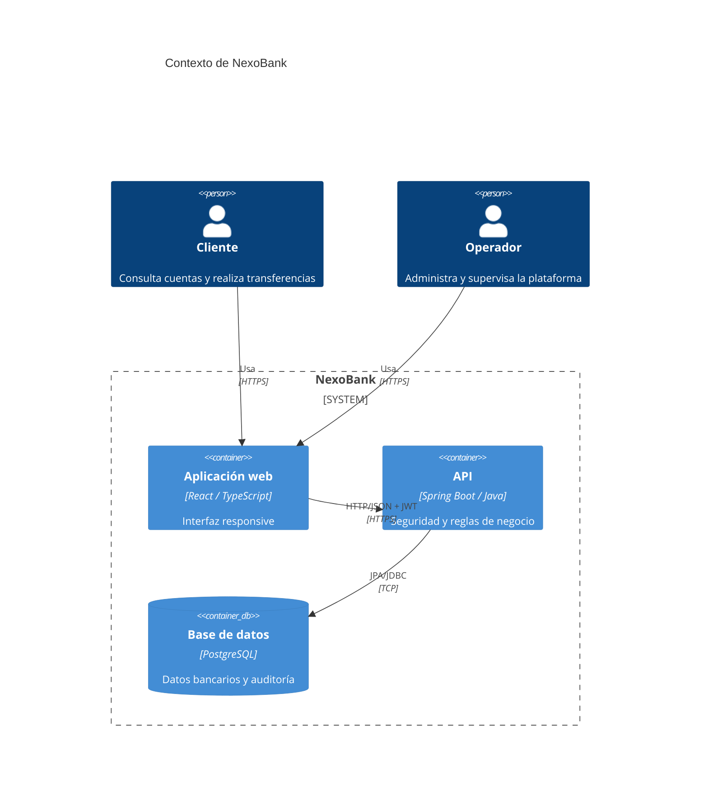

# Arquitectura de NexoBank

## Visión general

NexoBank es un monolito modular con una SPA independiente. El navegador carga React desde Nginx, la SPA consume
la API REST de Spring Boot y el backend es el único componente con acceso directo a PostgreSQL. Esta separación
mantiene el dominio y las reglas monetarias en el servidor sin añadir la complejidad operativa de microservicios.

## Componentes

### Frontend

- React Router define rutas públicas, protegidas y exclusivas de administración.
- TanStack Query administra caché, carga y revalidación de estado remoto.
- Axios centraliza la URL base, el bearer token y la renovación de sesión.
- Material UI aporta el sistema visual y componentes accesibles.
- Los módulos `src/features` encapsulan tipos, clientes API y diálogos por dominio.

### Backend

El código se agrupa por capacidad (`auth`, `user`, `customer`, `account`, `transaction`, `beneficiary`,
`transfer`, `audit`, `fraud` y `admin`). En cada módulo se mantienen estas responsabilidades:

- **Controller:** contrato HTTP, validación de entrada, autorización y códigos de respuesta.
- **Service:** reglas de negocio, coordinación de casos de uso y límites transaccionales.
- **Repository:** persistencia mediante Spring Data JPA.
- **Entidad:** estado y relaciones del dominio.
- **DTO:** contrato de entrada/salida; las entidades no se exponen por la API.

Los errores atraviesan `GlobalExceptionHandler` y se convierten en una respuesta uniforme. Un interceptor captura
IP y user-agent para que los casos sensibles registren su contexto en `audit_events`.

### Datos

PostgreSQL es la fuente de verdad. Flyway aplica migraciones inmutables al iniciar la API y Hibernate usa
`ddl-auto=validate`: valida el mapeo pero no modifica el esquema. Las cuentas incorporan una versión de bloqueo
optimista y las operaciones monetarias se ejecutan dentro de transacciones. El [DER](data-model.md) documenta
tablas, restricciones y relaciones.

## Seguridad

1. Spring Security valida credenciales con un hash de contraseña.
2. El login emite un JWT de acceso corto y un refresh token rotatorio, persistido como hash y entregado en cookie HttpOnly.
3. La SPA guarda solo el access token, lo adjunta a cada solicitud y usa la cookie HttpOnly en `/auth/refresh`.
4. El backend valida firma, emisor y expiración antes de construir la identidad autenticada.
5. Las reglas por rol se aplican en la cadena de seguridad y con `@PreAuthorize` en operaciones administrativas.
6. CORS solo acepta los orígenes declarados en `CORS_ALLOWED_ORIGINS`.

En producción todo el tráfico público debe usar HTTPS, los secretos se suministran desde un almacén seguro y la
base de datos no se expone a Internet.

## Consistencia monetaria

- Un depósito, retiro o ajuste actualiza el saldo y crea su movimiento en una única transacción.
- Una transferencia bloquea lógicamente el saldo mediante la versión de la cuenta, valida moneda y fondos,
  registra movimientos de salida/entrada y asientos de ledger antes de confirmarse.
- `idempotencyKey` es único: repetir una solicitud no debe volver a debitar la cuenta.
- Los comprobantes se derivan de transferencias completadas y no alteran el estado.
- Las reglas de fraude generan alertas independientes para revisión administrativa.

## Decisiones y límites

| Decisión | Motivo | Consecuencia |
| --- | --- | --- |
| Monolito modular | Entrega y transacciones simples | Se escala la API como una unidad |
| REST síncrono | Contrato fácil de consumir y documentar | Integraciones lentas requieren una evolución asíncrona |
| Flyway como fuente del esquema | Cambios repetibles y auditables | Toda modificación necesita una nueva migración |
| JWT + refresh token | Access tokens sin sesión en memoria | Se debe rotar/revocar el refresh token |
| UUID como identidad | IDs no secuenciales y portables | Índices mayores que con claves enteras |

## Despliegue

La imagen frontend compila la SPA y la sirve con Nginx; la imagen backend empaqueta el JAR; PostgreSQL conserva
sus archivos en un volumen. `docker-compose.yml` conecta los tres componentes para desarrollo. En un entorno
productivo se recomienda terminar TLS en un balanceador o ingress, mantener réplicas stateless de la API,
utilizar PostgreSQL administrado con copias de seguridad y centralizar métricas y logs.

Consulte [diagramas y flujos](flows.md) para las secuencias de autenticación, transferencia y auditoría.
