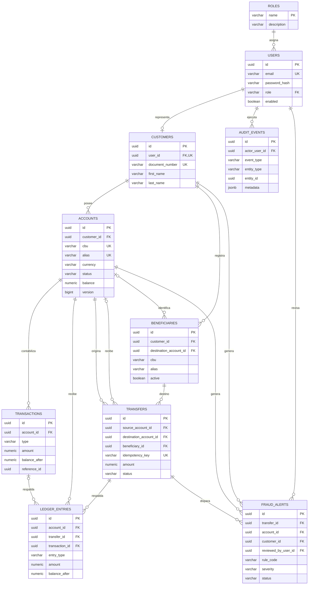

# Modelo de datos y DER

Las migraciones de `backend/src/main/resources/db/migration` son la fuente de verdad. Este diagrama presenta las
relaciones funcionales; `system_health` se omite porque solo verifica la migración inicial.

## Reglas relevantes

- Email, documento, CBU y alias son únicos; un usuario solo puede vincularse a un cliente.
- El saldo y `balance_after` nunca son negativos; los importes ordinarios son mayores que cero.
- Cuentas y transferencias restringen moneda a `ARS` o `USD`.
- Una CBU tiene exactamente 22 caracteres y un cliente no duplica la CBU de un destinatario.
- La clave idempotente de transferencia es única en toda la plataforma.
- Las relaciones opcionales permiten registrar destinatarios externos y alertas no asociadas a una transferencia.
- Todas las entidades operativas conservan marcas temporales; auditoría añade metadatos JSONB, IP y user-agent.

## Evolución

No edite una migración que ya haya sido aplicada. Agregue una nueva `V<n>__descripcion.sql`, compruebe la
compatibilidad con datos existentes y deje que Hibernate valide el resultado al iniciar la aplicación.
