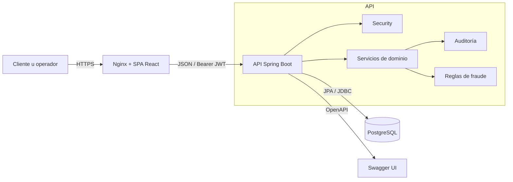
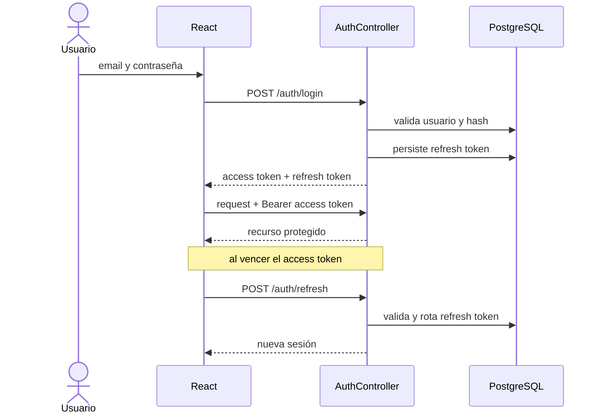
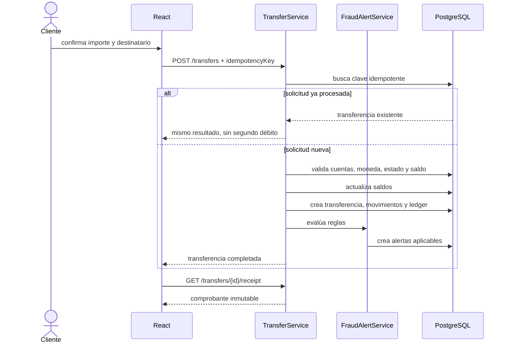
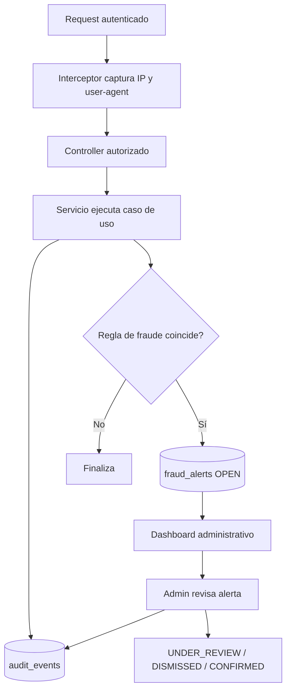
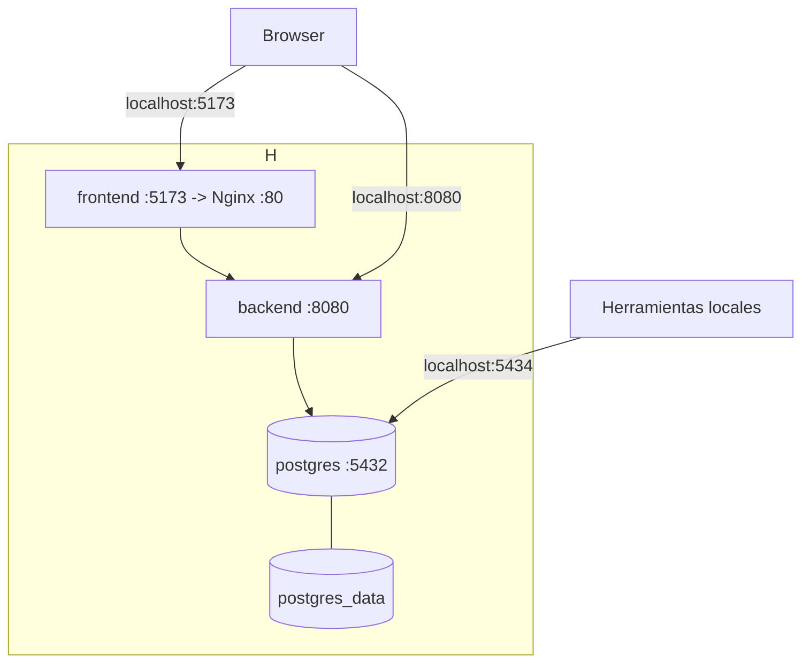

# Diagramas de arquitectura y flujos

## Contenedores en ejecución

## Login y renovación

## Transferencia interna

La modificación de saldos y la creación de registros asociados comparten una transacción de base de datos. Un
error provoca rollback. El control optimista evita que dos escrituras concurrentes sobrescriban el mismo saldo.

## Auditoría y revisión de fraude

## Despliegue con Compose

Compose espera que el healthcheck de PostgreSQL pase antes de iniciar el backend. Para producción, reemplace los
puertos públicos por una red privada, termine HTTPS en un proxy/ingress y use credenciales externas al repositorio.
